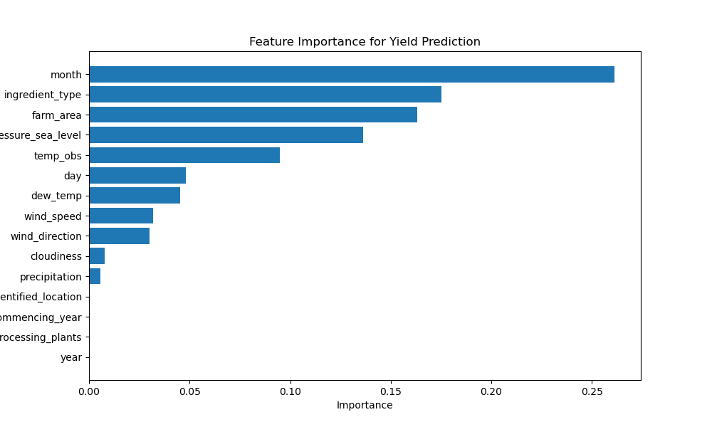
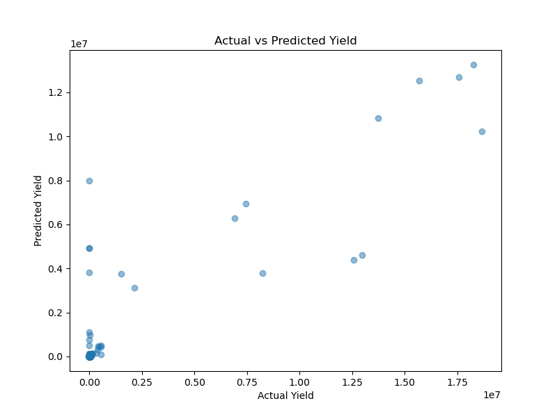

# Farm Yield Prediction using Machine Learning

## Project Overview
This project predicts agricultural yield using farm characteristics and weather data.  
Machine learning models analyze environmental and farm factors that influence crop yield.

## Dataset
The dataset includes:

• Farm attributes  
• Ingredient types  
• Weather observations  
• Yield production  

A small sample dataset is included for demonstration.

## Machine Learning Workflow

1. Data Cleaning
2. Feature Engineering
3. Dataset Merging
4. Exploratory Data Analysis
5. Model Training
6. Model Evaluation

## Models Used

- Linear Regression
- Decision Tree Regressor
- Random Forest Regressor

## Model Performance

| Model | RMSE |
|------|------|
Linear Regression | 137693 |
Decision Tree | 105204 |
Random Forest | **65135** |

Best Model: Random Forest

## Visualizations

### Feature Importance

### Model Performance

## Technologies Used

Python  
Pandas  
NumPy  
Scikit-learn  
Matplotlib  
Seaborn  

## Author
Preetham Padala
